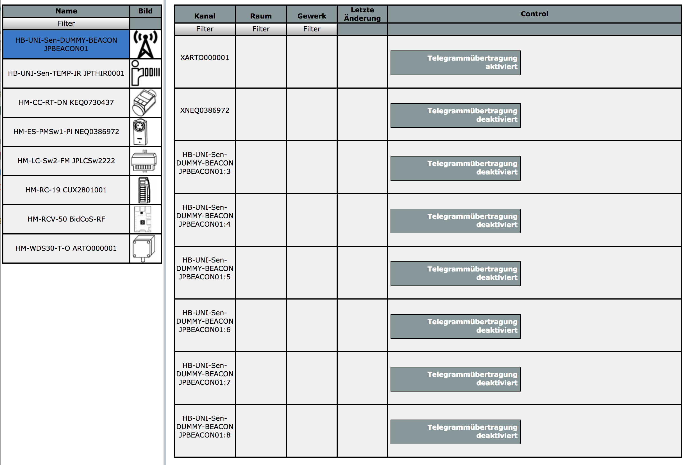
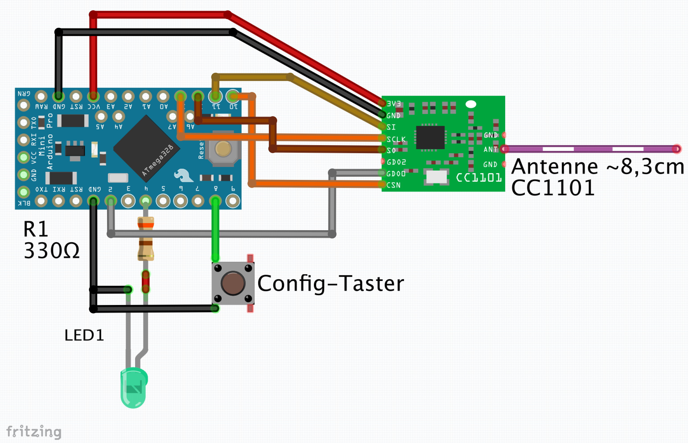
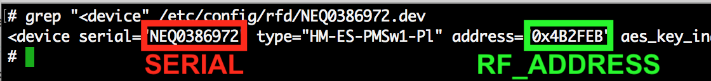
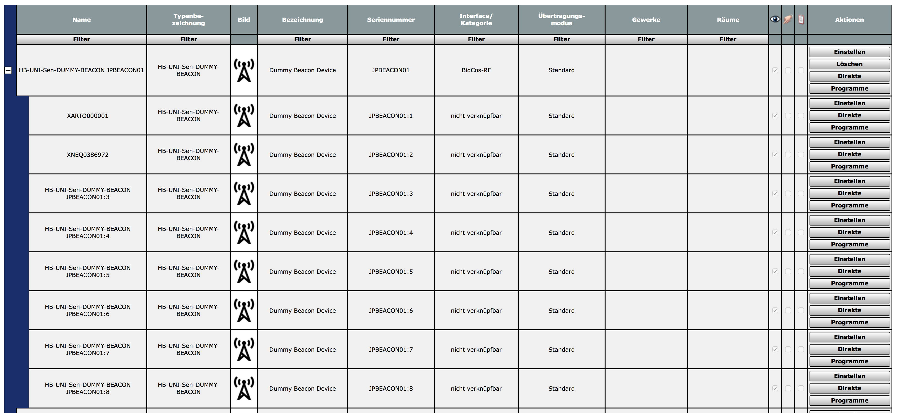
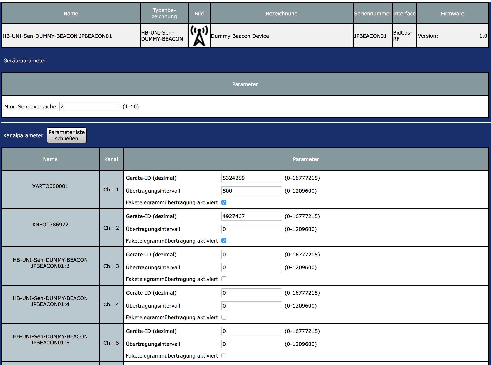

# HB-UNI-Sen-DUMMY-BEACON
**Dummy-Device zum Vermeiden von "Kommunikation gestört"-Servicemeldungen von bis zu 8 inaktiven HomeMatic-Geräten (nur HM-RF, kein HmIP / Wired).** 

Die ist z.B. sehr nützlich bei saisonal verwendeten Geräten, die in Programmen, Diagrammen etc. verwendet, jedoch z.B. in Wintermonaten nicht genutzt werden.
Denn ein Ablernen der Geräte während der Nutzungspausen würde bedeuten, dass Programme nach dem erneuten Anlernen wieder bearbeitet werden müssten.

Es erfolgt:
 - eine automatische Aussendung zyklischer Telegramme an die CCU (bei Sensoren)
 - eine Quittung (Ack) von Steuerbefehlen der CCU (bei Aktoren)
 
_Wird ein Telegramm des "echten" Gerätes empfangen, so wird das Aussenden der Fake-Telegramme automatisch deaktiviert, um Kollisionen / Fehlverhalten zu vermeiden._
 
 

## Hardware
### Bauteile
 - 1x Arduino Pro Mini (3.3V 8MHz)
 - 1x CC1101 Funkmodul 868MHz
 - 1x FTDI Adapter
 - 1x Taster
 - 1x Widerstand 330Ohm
 - 1x LED
 
### Verdrahtung

Die Stromversorgung erfolgt indealerweise aus einem 5V-Steckernetzteil und wird an **RAW** (+) sowie **GND** (-) des Pro Mini angeschlossen.

## Software
### Arduino IDE
- Arduino IDE [herunterladen](https://www.arduino.cc/en/Main/Software) und installieren
- AskSinPP Bibliothek als [ZIP herunterladen](https://github.com/pa-pa/AskSinPP/archive/master.zip) 
- notwendige Bibliotheken in der Arduino IDE hinzufügen:
  - Sketch -> Bibliothek einbinden -> .ZIP-Bibliothek hinzufügen
    - heruntergeladene AskSinPP Bibliothek ZIP-Datei auswählen
  - Sketch -> Bibliothek einbinden -> Bibliotheken verwalten
    - im Suchfeld folgende Bibliotheken suchen und installieren:
      - EnableInterrupt
      - Low-Power
 - Board einstellen:
   - Board: `Arduino Pro or Pro Mini`
   - Prozessor: `ATmega328P (3.3V, 8 MHz)`
   - Port: `COM-Port` des FTDI Adapters  
 - Sketch öffnen. (Die 3 Dateien [HB-UNI-Sen-DUMMY-BEACON.ino](https://raw.githubusercontent.com/jp112sdl/HB-UNI-Sen-DUMMY-BEACON/master/HB-UNI-Sen-DUMMY-BEACON.ino), [HB_Device.h](https://raw.githubusercontent.com/jp112sdl/HB-UNI-Sen-DUMMY-BEACON/master/HB_Device.h) und [HB_MultiChannelDevice.h](https://raw.githubusercontent.com/jp112sdl/HB-UNI-Sen-DUMMY-BEACON/master/HB_MultiChannelDevice.h) müssen sich in einem gemeinsamen Verzeichnis befinden.)
            
- Sketch hochladen:
  - Sketch
    - Hochladen

## HomeMatic
### Addon installieren
Damit das Gerät von der CCU erkannt und unterstützt wird, ist es erforderlich, das [JP-HB-Devices-addon](https://github.com/jp112sdl/JP-HB-Devices-addon) zu installieren. Es wird **mindestens Version 1.18** benötigt.

### Anlernen an HomeMatic
Das Anlernen erfolgt nach Installation des Addons wie man es von anderen HomeMatic-Geräten gewohnt ist:
- Geräte anlernen -> HM-Gerät anlernen klicken
- **Config-Taster** am Arduino Pro Mini **kurz** drücken
- das neue Gerät erscheint anschließend im Posteingang

### Konfiguration
Damit das Dummy-Device weiß, wessen Telegramme es nun ersetzen soll, müssen die **Adressen** _(Achtung: nicht die Seriennummern!)_ der Geräte im Dummy-Device hinterlegt werden.
 
_Hintergrund-Info: 
Anhand der Seriennummer wird ein HomeMatic Gerät nicht im Funkprotokoll identifiziert. Dies geschieht ausschließlich über die Geräteadresse. Die Adresse (RF_ADDRESS) eines HomeMatic-Geräts ist leider nicht ohne Umwege in der WebUI ersichtlich.
Sie lässt sich beispielsweise als hexadezimalwert dem Device-File im Dateisystem `/etc/config/rfd/<SERIAL.dev>` entnehmen: 

 _

Um das Hinterlegen der gewünschten Adressen weitestgehend zu automatisieren ist wie folgt vorzugehen:  
**1.** In den Geräteeinstellungen des Dummy-Device ist ein Kanal umzubenennen. 
Der Kanalname muss beginnen mit **X** gefolgt von der Seriennummer, des HomeMatic Geräts, das abgebildet werden soll. 
Beispiel: 
 - das HomeMatic-Gerät hat die Seriennummer: **NEQ0386972**
 - der Kanalname des Dummy-Device muss lauten: **XNEQ0386972**

  
 
 **2.** Ausführen des [Parametrierungsskripts](https://raw.githubusercontent.com/jp112sdl/HB-UNI-Sen-DUMMY-BEACON/master/additional/ccu_script.txt) auf der CCU. 
(Sollte die Seriennummer des Dummy-Device *nicht* **JPBEACON01** lauten, so ist diese im Skript entpsrechend zu ändern (`string FAKEDEV = "JPBEACON01";`).)
 
Durch Ausführen des Skripts werden nun die Adressen der Geräte ausgelesen und zum Dummy-Device übertragen.

**3.** Einstellungen 

 
In den Einstellungen können Parameter
 - für das Gerät
   - Max. Sendeversuche: Anzahl der Sendeversuche bei bidirektionalen Nachrichten
 - je Kanal (also je emuliertem Gerät)
   - Geräte-ID: RF-Adresse; hier dezimal! (wird vom Skript gesetzt)
   - Übertragungsintervall: alle x Sekunden wird ein zyklisches Telegramm gesendet (nur bei Sensoren, bei Aktoren (außer HM-ES-PMSw1-xxx) auf 0 lassen!); die eingegebene Zeit muss kleiner sein als der von HomeMatic erwartete Wert (siehe unten stehende Tabelle)
   - Telegrammübertragung aktiviert: Dummy-Nachrichten werden für dieses Gerät generiert
 
 festgelegt werden.

**4.** Betrieb 
Unter "Status und Bedienung"->"Geräte" ist eine Übersicht der aktivierten Kanäle zu sehen. 

  
**Achtung:** Der Status der Telegrammübertragung (aktiviert / deaktiviert) muss nicht zwingend der Einstellung wie unter **3.** festgelegt entsprechen! 
Es wird der tatsächliche Status wiedergegeben. Ist z.B. ein Kanal in **3.** aktiviert und es wird jedoch ein Funktelegramm vom "echten" HomeMatic-Gerät empfangen, wird der Kanal in der Übersicht deaktiviert!

**Diese README ist garantiert nicht vollständig! Bei Unklarheiten bitte ein Issue erstellen.**

#### CYCLIC_TIMEOUT Werte der HomeMatic-Geräte:

| Device Type | Timeout | Device ID |
|--------|--------|--------|
| HM-CC-RT-DN | 600 | 0x0095 | 
| HM-CC-RT-DN-BoM | 552 | 0x00bd | 
| HM-CC-SCD | 88200 | 0x0056 | 
| HM-CC-TC | 600 | 0x0039 | 
| HM-CC-VD | 3600 | 0x003a | 
| HM-ES-PMSw1-DR | 600 | 0x00ea | 
| HM-ES-PMSw1-Pl | 600 | 0x00ac | 
| HM-ES-PMSw1-Pl-DN-R1 | 600 | 0x00d7 | 
| HM-ES-PMSw1-Pl-DN-R2 | 600 | 0x00e2 | 
| HM-ES-PMSw1-Pl-DN-R3 | 600 | 0x00e3 | 
| HM-ES-PMSw1-Pl-DN-R4 | 600 | 0x00e4 | 
| HM-ES-PMSw1-Pl-DN-R5 | 600 | 0x00e5 | 
| HM-ES-PMSw1-S | 600 | 0x00f6 | 
| HM-ES-TX-WM | 600 | 0x00de | 
| HM-SCI-3-FM | 88200 | 0x005f | 
| HM-Sec-MDIR | 1200 | 0x004a | 
| HM-Sec-MDIR-2 | 1200 | 0x00c0 | 
| HM-Sec-MDIR-3 | 1200 | 0x00f7 | 
| HM-Sec-RHS | 88200 | 0x0030 | 
| HM-Sec-SC | 88200 | 0x002f | 
| HM-Sec-SC-2 | 88200 | 0x00b1 | 
| HM-Sec-SCo | 10000 | 0x00c7 | 
| HM-Sec-SD | 1209600 | 0x0042 | 
| HM-Sec-SD-2 | 259200 | 0x00aa | 
| HM-Sec-TiS | 88200 | 0x0043 | 
| HM-Sec-WDS | 88200 | 0x0045 | 
| HM-Sec-WDS-2 | 88200 | 0x00b2 | 
| HM-Sen-LI-O | 88200 | 0x00fd | 
| HM-Sen-RD-O | 88200 | 0x00a7 | 
| HM-Sen-Wa-Od | 88200 | 0x009f | 
| HM-TC-IT-WM-W-EU | 600 | 0x00ad | 
| HM-WDS10-TH-O | 600 | 0x003d | 
| HM-WDS100-C6-O | 600 | 0x0040 | 
| HM-WDS100-C6-O-2 | 600 | 0x00ae | 
| HM-WDS20-TH-O | 600 | 0x003c | 
| HM-WDS30-OT2-SM | 40000 | 0x00a8 | 
| HM-WDS30-OT2-SM-2 | 40000 | 0x0102 | 
| HM-WDS30-T-O | 600 | 0x000f | 
| HM-WDS40-TH-I | 600 | 0x003f | 
| HM-WDS40-TH-I-2 | 600 | 0x00bc | 

